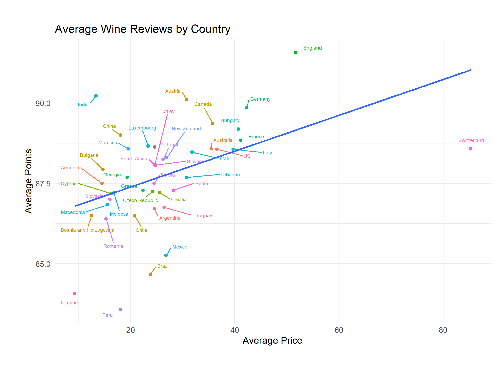

## R-challenge

# Wine Analysis

The original .csv contained 130k reviewed wines with the following columns: country, description, designation, points, price, province, region_1, region_2, taster_name, taster_twitter_handle, title, variety, winery. In this analysis, I looked at the country of origin, points, price, and variety. The other variables were simply too varied to make any meaningful visualizations.

The below figure shows us the average points and average price of the wines produced by each country. I reversed the axes of points and price to better illustrate which countries produce higher-quality, cheaper wines above the line of best fit. Although the different quantities of wines from each country could potentially skew the data, the visualization would suggest that Swiss wines are more expensive and a lower quality, while English wines are cheaper and higher-quality on average.

The graphs which use Top 50 Winery or Top 50 Variety means that they had the highest counts of wines in the data. Of the top 50 wineries, many of them are American, which is unsurprising as the dataset was dominated by American wines.

The dataset had a disproportionate number of American wines (~54K of 130K).

Many varieties of wine were represented in the dataset, but Pinot Noirs and Chardonnays represented the most common red and white variety among the data.

Toward the high end of the spectrum, price and points did seem to correlate. Very high-quality wines were worth more, on average.

Installs necessary:
R: https://cran.r-project.org/mirrors.html
RStudio: https://www.rstudio.com/products/rstudio/download/
Rtools: https://cran.r-project.org/bin/windows/Rtools/